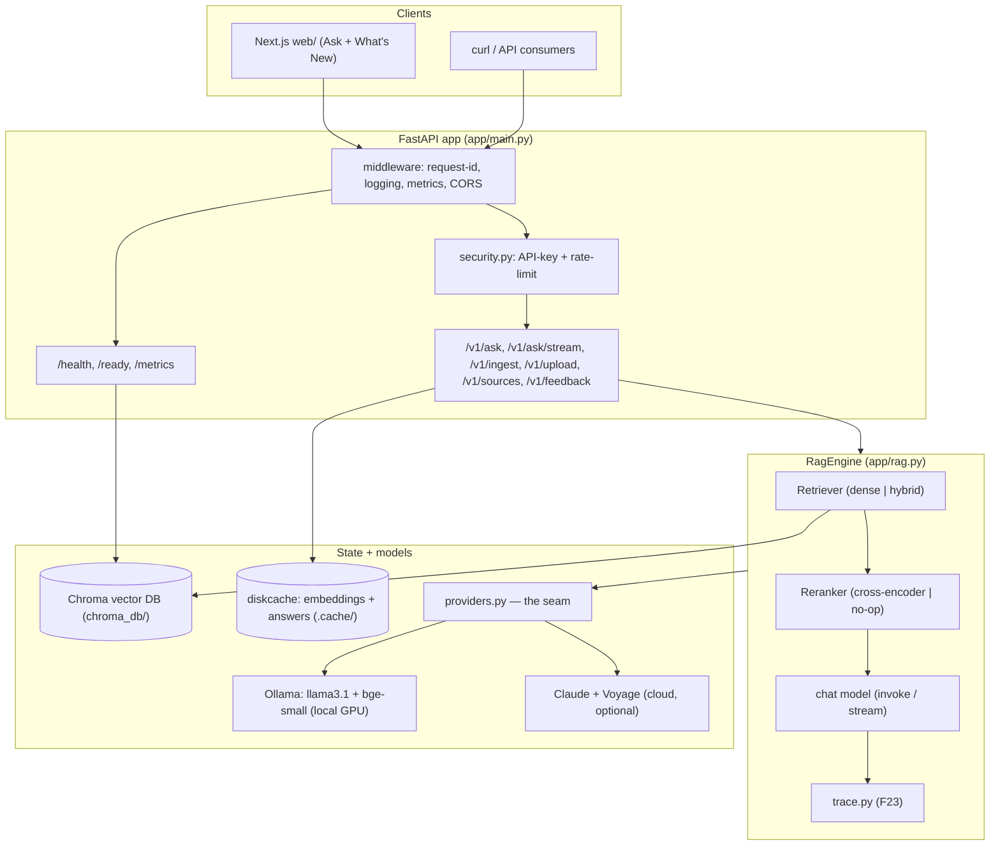
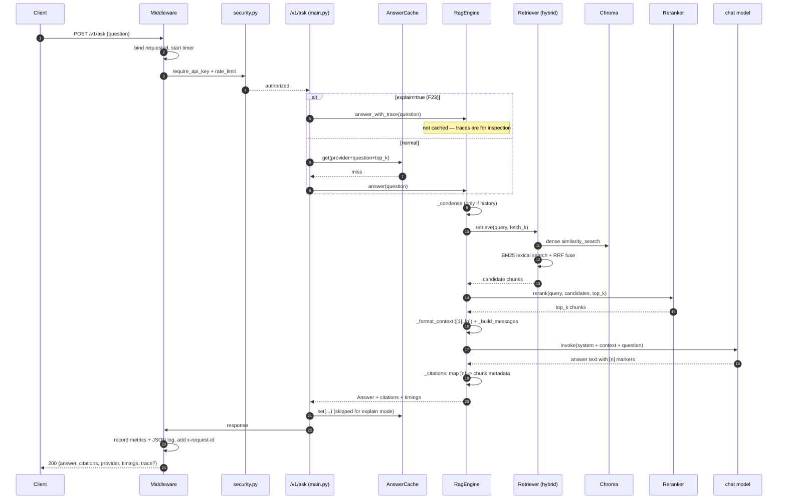
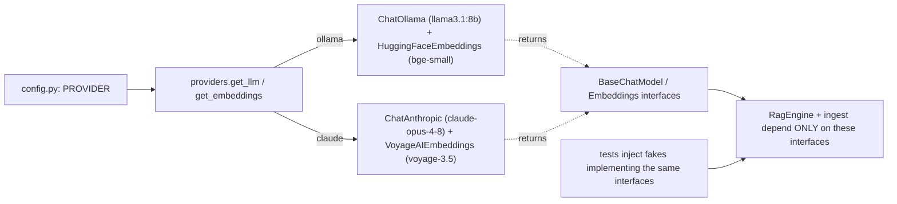
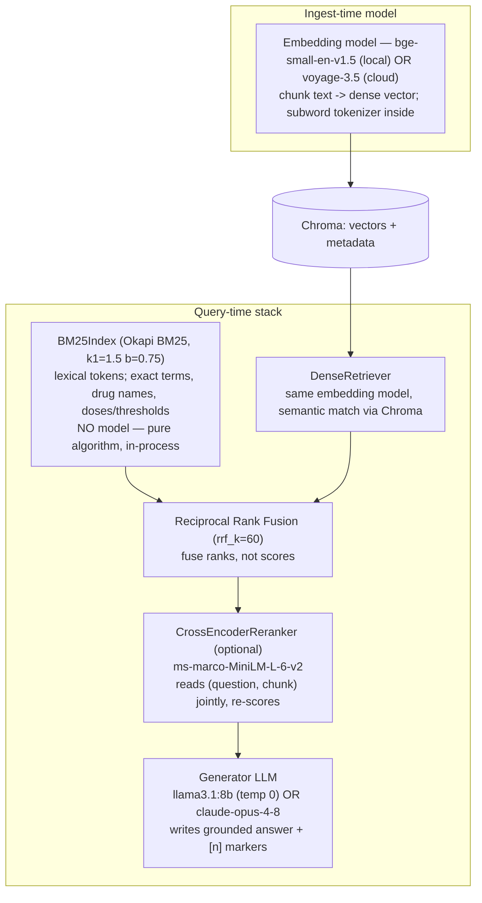

# Architecture

> One RAG engine behind a FastAPI service and a Next.js UI. The whole design hangs on one
> seam: **everything depends on LangChain interfaces, never a vendor class.** That seam is
> what makes the free↔paid provider switch *and* fully offline tests possible.
>
> For the stage-by-stage RAG walkthrough see [`HOW-RAG-WORKS.md`](HOW-RAG-WORKS.md); for
> the offline ingest half see [`INGESTION.md`](INGESTION.md). This doc is the system +
> ML-pipeline view.

## Context / why these choices

We need answers a user can *trust* over clinical reference documents: grounded in real
passages, traceable to a source, and runnable with no paid API keys. Three consequences:

1. **Local Chroma** — a persistent vector DB that needs no server.
2. **A provider seam** (`app/providers.py`) — depend on interfaces, so the model backend
   is a single env var and tests inject fakes.
3. **Citations from retrieval metadata** — a `[n]` marker always maps to a real chunk,
   never a hallucinated reference.

---

## Components

| Module | Responsibility |
|---|---|
| `app/config.py` | All settings via pydantic-settings; the `PROVIDER` switch and every tunable |
| `app/providers.py` | **The seam.** `get_llm` / `get_embeddings` return LangChain interfaces per provider |
| `app/ingest.py` | Load → clean → split → dedupe → embed → persist (idempotent rebuild) |
| `app/ocr.py` | OCR for images + scanned PDFs (Tesseract, F20) |
| `app/cleaning.py` | Deterministic text normalization + near-dup chunk removal (F21) |
| `app/retrieval.py` | `DenseRetriever`, `BM25Index`, `HybridRetriever`, RRF fusion (F16) |
| `app/rerank.py` | Cross-encoder reranker + no-op fallback (F17) |
| `app/rag.py` | `RagEngine`: condense → retrieve → rerank → prompt → LLM → answer + citations + trace |
| `app/trace.py` | Pipeline introspection trace (F23) |
| `app/prompts.py` | Domain system prompt + follow-up condense prompt |
| `app/cache.py` | Embedding cache + answer cache (diskcache) |
| `app/security.py` | API-key auth + token-bucket rate limiting |
| `app/observability.py` | JSON logging, request IDs, Prometheus metrics |
| `app/feedback.py` | 👍/👎 capture to seed an eval set (F19) |
| `app/main.py` | FastAPI wiring, `/v1` routes, streaming, ops endpoints |
| `web/` | Next.js UI (Ask page + "What's New") |

### System diagram

---

## Request lifecycle

The engine is built **once at startup** (`build_engine` in `lifespan`) and stored on
`app.state`, so requests are cheap and tests can swap in a fake engine. If the index
isn't built yet, startup degrades gracefully (`engine = None`) and `/v1/*` returns `503`
until you ingest.

A non-streaming `POST /v1/ask` (single turn, cache miss):

Notes worth internalizing:

- **Auth/limit are dependencies** on the `/v1/*` routes (`_guarded`). If `API_KEY` is
  empty (local default), auth is a no-op; rate limiting is per key (or client IP).
- **Answer cache** keys on `sha256(provider, question, top_k)`; follow-ups fold history
  into the key so they don't collide with the same words asked cold. **Explain mode
  bypasses the cache** entirely.
- **Streaming** (`/v1/ask/stream`) uses SSE: `engine.stream` yields `token` events then a
  final `citations` event and `done` — same retrieval, incremental generation.
- Middleware emits a Prometheus counter/histogram and a structured JSON log per request,
  and per-stage `ASK_LATENCY` (`condense` / `retrieve` / `generate`).

---

## The provider seam

Everything upstream of `providers.py` depends on **LangChain abstractions**
(`BaseChatModel`, `Embeddings`) — never `ChatOllama`, `ChatAnthropic`, etc. directly. One
factory decides the concrete class from `settings.provider`, and imports are lazy so an
unused backend's package need not be installed (or reachable) to run or test.

Why it matters:

| Benefit | How the seam delivers it |
|---|---|
| Free↔paid switch | one env var `PROVIDER=ollama|claude`; no code change |
| Offline CI | tests inject fake `BaseChatModel` / `Embeddings` / `Retriever` / `Reranker` — no network, no model download |
| Swap retrieval / rerank | `RagEngine` takes a `Retriever` and `Reranker` **protocol**; `build_retriever` / `build_reranker` pick the impl by config |
| Trustworthy citations | `RagEngine` never sees a vendor response shape — it works off `Document` metadata |

> **Consequence:** `ollama` and `claude` embed into **different vector spaces**. Changing
> `PROVIDER` invalidates the index — **re-ingest** before querying.

---

## The ML pipeline view

RAG here is really **four models/algorithms** stacked, each doing one job. Three are
swappable behind interfaces; one (BM25) is a dependency-free algorithm baked in.

| Layer | Model / algorithm | Role | Trainable objective it exploits | Config |
|---|---|---|---|---|
| Embedding | `bge-small-en-v1.5` / `voyage-3.5` | text → vector (semantic) | contrastive sentence similarity | `HF_EMBED_MODEL` / `VOYAGE_MODEL` |
| Lexical | Okapi BM25 (`BM25Index`) | exact-term ranking | TF·IDF with length normalization | `k1=1.5, b=0.75` (in code) |
| Fusion | Reciprocal Rank Fusion | merge dense + lexical rankings | rank-only, scale-free | `RRF_K`, `RETRIEVE_FETCH_K` |
| Rerank | cross-encoder MiniLM | precise (q, chunk) relevance | pairwise relevance (MS MARCO) | `RERANK_ENABLED`, `RERANK_MODEL` |
| Generation | `llama3.1:8b` / `claude-opus-4-8` | grounded answer + citations | instruction-following chat | `OLLAMA_LLM_MODEL` / `ANTHROPIC_MODEL`, `MAX_TOKENS` |

**Why this specific stack?** Dense retrieval catches *meaning* but blurs exact
figures/names; BM25 catches *exact terms* but misses paraphrase — hybrid + RRF gets both.
The cross-encoder is the precision layer (expensive, so opt-in) that promotes the truly
answering passage. The generator is deliberately constrained by the system prompt to
*only* summarize the retrieved passages and cite them — its temperature is `0` on the
local path for determinism.

---

## Local-first by default, cloud optional

| | Default (local-first) | Optional (cloud) |
|---|---|---|
| `PROVIDER` | `ollama` | `claude` |
| LLM | `llama3.1:8b` on **Ollama** (RTX GPU on the run host) | `claude-opus-4-8` |
| Embeddings | `bge-small-en-v1.5` (HuggingFace, local) | Voyage `voyage-3.5` |
| Keys needed | none | `ANTHROPIC_API_KEY`, `VOYAGE_API_KEY` |
| Runs offline | yes (after first model download) | no |

Keys live **only in a gitignored local `.env`** (`config.py` loads via pydantic-settings;
`api_key`, `anthropic_api_key`, `voyage_api_key` default to empty). The whole app is built
to run free and offline first; the cloud path is a one-env-var upgrade, not a rewrite.

---

## Key decisions (see `adr/`)

- **Provider abstraction** ([ADR-0001](adr/0001-provider-abstraction.md)) — the seam
  above; enables the free/paid switch *and* offline tests.
- **Citations from retrieval metadata** ([ADR-0002](adr/0002-citations-from-retrieval-metadata.md))
  — a citation always traces to a real chunk, never a hallucinated reference.

## Gotchas

- First ingest with the Ollama provider **downloads the HF embedding model** (once).
- Chroma is local/single-node — not built for horizontal scale (fine for this scope).
- Switching `PROVIDER` changes the embedding space → **re-ingest** before querying.
- BM25 is built from a **snapshot** of the collection; `/v1/upload` rebuilds the retriever
  so the lexical arm sees new chunks (the dense arm reads Chroma live).
- The `dense_score` in an F23 trace is Chroma's **distance** (lower = closer), not a 0–1
  similarity, and reflects only the dense arm — not the RRF order that actually ranked the
  chunks.
