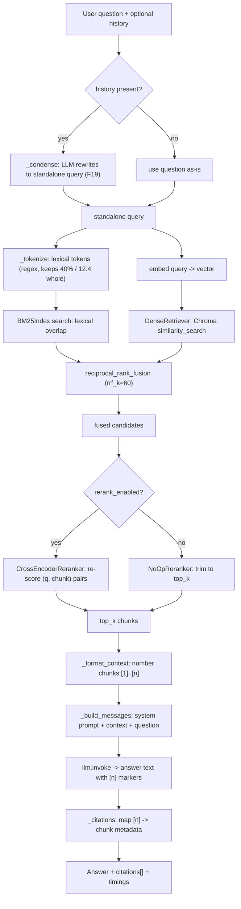
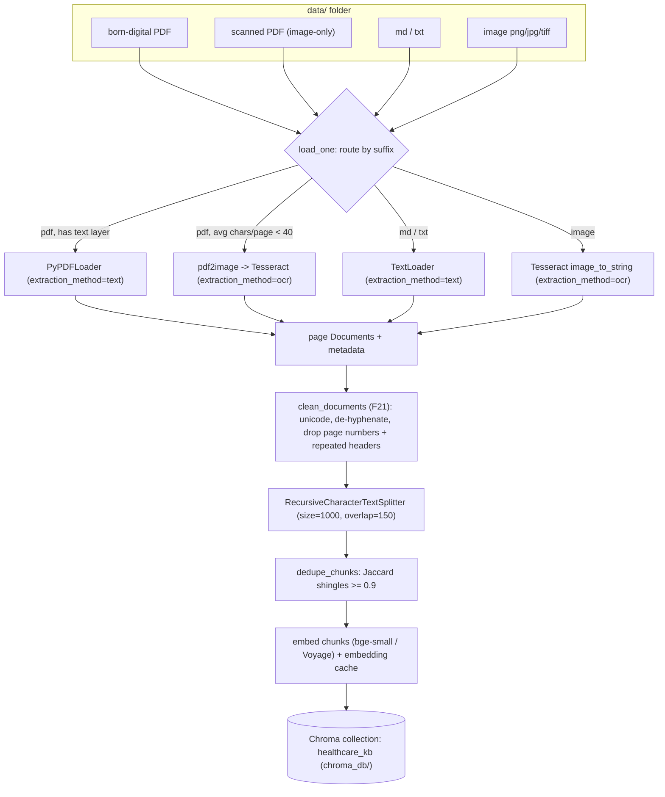

# How RAG Works (in this app)

> **Goal of this doc:** give you a *complete mental model* of what happens between
> dropping a PDF into `data/` and getting back a grounded answer with `[n]` citations.
> Every claim here is traced to the real code (`app/*.py`). Where you can *see* a stage
> live, we point you at the F23 trace (`POST /v1/ask?explain=true` → `explain: true`).

Retrieval-Augmented Generation (RAG) is a simple idea with a lot of moving parts:
**don't ask the LLM to remember facts — fetch the relevant text first, then ask the LLM
to answer *using only that text*.** That single discipline is what makes answers
*grounded* (from real passages) and *citable* (each `[n]` maps to a chunk you can read).

This app is the **Healthcare Knowledge Navigator**: it answers clinical questions over
medical reference documents (guidelines, drug information, study abstracts) and cites the
source passage for every claim.

---

## The two pipelines

RAG has an **offline** half and an **online** half. They meet at the vector store.

| | Ingestion (offline, run once / on upload) | Query (online, per request) |
|---|---|---|
| Trigger | `python -m app.ingest`, `/v1/ingest`, `/v1/upload` | `POST /v1/ask` |
| Input | files in `data/` | a user question (+ optional history) |
| Output | a persisted **Chroma** collection of embedded chunks | an answer + `[n]` citations |
| Code | `app/ingest.py`, `app/ocr.py`, `app/cleaning.py` | `app/rag.py`, `app/retrieval.py`, `app/rerank.py` |

---

## Stage-by-stage walkthrough

### 1. Document → text extraction (text layer vs OCR)

A "document" on disk is not text — it's a container. `load_one()` in `app/ingest.py`
routes each file to the right extractor based on its suffix:

| File type | Extractor | `extraction_method` stamped |
|---|---|---|
| `.md`, `.txt`, `.markdown` | `TextLoader` (UTF-8) | `text` |
| **Born-digital** `.pdf` (has a text layer) | `PyPDFLoader` | `text` |
| **Scanned** `.pdf` (image-only, no text layer) | OCR: `pdf2image` → Tesseract (`app/ocr.py`) | `ocr` |
| `.png/.jpg/.tiff/.bmp/.webp` | OCR: Tesseract directly | `ocr` |

The clever bit is **scanned-PDF detection** (`ocr.pdf_needs_ocr`): it reads the PDF's
existing text layer with `pypdf` and computes *average characters per page*. If that's
below `ocr_min_chars_per_page` (default **40**), the PDF is treated as scanned and sent
to OCR; otherwise the born-digital text layer is used directly — so digital PDFs never
pay the (slow) OCR cost. Each extracted page becomes a `Document` with metadata
`source`, `page`, `extraction_method`. See [`INGESTION.md`](INGESTION.md) for depth.

### 2. Cleaning (F21)

Raw PDF/OCR text is noisy: weird unicode, words hyphenated across line breaks
(`inter-\nnational`), bare page-number lines, and headers/footers repeated on every
page. That noise pollutes both embeddings and lexical matching. `clean_documents()` in
`app/cleaning.py` fixes it *deterministically* (no model calls), so it's fast, testable,
and explainable. Steps, in fixed order:

1. `normalize_unicode` (NFKC) — canonicalize look-alike characters.
2. `strip_control_chars` — remove non-printable bytes.
3. `join_hyphenated_linebreaks` — re-join `inter-\nnational` → `international`.
4. `drop_page_number_lines` — delete lines that are just `12` or `Page 3 / 20`.
5. `collapse_whitespace` — squeeze runs of spaces/newlines.

Plus a **document-level** pass: `_detect_repeated_lines` groups pages by `source` and
removes any short line that recurs on ≥ 60% of pages (a running header/footer). Cleaning
can emit a `CleanReport` (chars before/after, which steps ran) — that's what the F23
trace can surface as a raw → cleaned diff.

### 3. Chunking (RecursiveCharacterTextSplitter)

An LLM can't be handed a whole 100-page clinical guideline, and a vector search over a whole document
is too coarse. So each `Document` is sliced into **chunks** by
`RecursiveCharacterTextSplitter` (`split_documents` in `app/ingest.py`):

| Param | Default | Meaning |
|---|---|---|
| `chunk_size` | **1000** chars | target maximum size of a chunk |
| `chunk_overlap` | **150** chars | trailing chars repeated at the start of the next chunk |
| `add_start_index` | `True` | records each chunk's char offset in its source |

**Why "recursive"?** The splitter tries to break on the *largest* natural boundary
first (paragraph `\n\n`, then line `\n`, then space, then character), so chunks stay
semantically whole instead of being cut mid-sentence. **Why overlap?** A fact that
straddles a chunk boundary would be split in half; the 150-char overlap means the
boundary sentence appears in *both* neighbouring chunks, so retrieval can still find it.

After splitting, `dedupe_chunks()` drops near-duplicates using **Jaccard similarity over
5-word shingles** (`dedupe_threshold` 0.9) — this kills boilerplate paragraphs that
repeat across a corpus (e.g. copyright/licence disclaimers on every article).

### 4. Embedding (bge-small / Voyage)

Each chunk is turned into a **vector** — a list of floats that encodes its *meaning* —
by an embedding model. The model is chosen by the `PROVIDER` switch (`app/providers.py`):

| Provider | Embedding model | Where it runs |
|---|---|---|
| `ollama` (default, free) | HuggingFace `BAAI/bge-small-en-v1.5` | local (downloads once, then offline) |
| `claude` | Voyage `voyage-3.5` | cloud API (needs `VOYAGE_API_KEY`) |

Two chunks about "revenue growth" land *near each other* in this vector space even if
they share no exact words — that's **semantic** similarity, the thing keyword search
can't do. Embeddings are wrapped by a persistent cache (`wrap_embeddings`, `app/cache.py`)
so re-ingesting unchanged chunks doesn't re-embed them.

> **Switching provider changes the embedding space.** `ollama` and `claude` produce
> incompatible vectors, so you must **re-ingest** after changing `PROVIDER`.

### 5. Vector store (Chroma)

The (chunk, vector, metadata) triples are written to a local, persistent **Chroma**
collection (`healthcare_kb`) under `chroma_db/`. `build_index()` is *idempotent*: it
resets the collection first, so re-running reflects exactly the current `data/` folder.
This is the boundary between the two pipelines — ingestion writes here, querying reads.

---

## The query pipeline

Now the online half. A question comes in at `POST /v1/ask` and flows through
`RagEngine.answer()` (`app/rag.py`).

### 6. Condense (F19, multi-turn only)

If the request carries conversation `history`, `_condense()` asks the LLM to rewrite a
follow-up ("what about *its* dosing?") into a **standalone query** ("what is metformin's
dosing?") so retrieval works on a self-contained question. No history → the question is
used as-is. Any failure falls back to the original question (never regress single-turn).

### 7. Query → tokenization → retrieval

This is the heart of RAG, and it happens **two ways at once** (hybrid retrieval, F16).

#### "text → tokens": two different tokenizers

Tokenization = chopping a string into the atomic units a system compares. **This app
uses two tokenizers, and confusing them is the #1 RAG misconception**, so make it
concrete:

| | Lexical / BM25 tokenizer | Embedding model's subword tokenizer |
|---|---|---|
| Where | `_tokenize()` in `app/retrieval.py` | inside `bge-small` / Voyage (opaque) |
| Rule | regex `[a-z0-9]+(?:[.,%$][a-z0-9]+)*`, lowercased | learned subword vocabulary (WordPiece/BPE-style) |
| `"eGFR below 30 mL/min"` → | `["egfr", "below", "30", "ml", "min"]` | e.g. `["eg", "##fr", "below", "30", "ml", "/", "min"]` (illustrative) |
| Purpose | exact-term matching (BM25 counts token overlap) | build the meaning vector for semantic search |
| You can see it | **yes** — F23 trace `tokenization` field | no (internal to the model) |

**Why tokenization matters:** BM25 can only match tokens it can produce. The regex
deliberately keeps figures whole — `30`, `12.4`, `2.5mg` stay single tokens — because in
clinical text a dose or threshold *is* the query. If the tokenizer split `2.5mg` into `2.5`
and `mg`, a search for "2.5mg dose" would match every "2.5" in the corpus. Meanwhile the embedding
tokenizer's job is different: it splits into subwords so the model can represent *any*
word (even unseen ones) as a vector. Same input text, two tokenizations, two purposes.

The F23 trace shows the **lexical** tokenization explicitly (`TokenizationTrace`), with a
`note` reminding you the dense arm uses the model's subword tokenizer instead.

#### Two retrieval arms, fused by RRF

```
                    ┌── DenseRetriever ──► vector similarity_search (semantic)  ─┐
  query (tokenized) ┤                                                            ├─► RRF fuse ─► top-k
                    └── BM25Index ────────► lexical token-overlap score          ─┘
```

- **Dense** (`DenseRetriever`): embeds the query and asks Chroma for the nearest chunk
  vectors. Great at *meaning* ("first-line therapy" ≈ "preferred initial treatment").
- **Lexical** (`BM25Index`, dependency-free, in-process): classic Okapi BM25 over the
  chunk tokens. Great at *exact terms, drug names, doses, thresholds* the embedder might blur.
- **Fusion** (`reciprocal_rank_fusion`): each arm fetches `retrieve_fetch_k` (20)
  candidates; RRF scores each chunk `Σ 1 / (rrf_k + rank)` across the lists it appears in
  (`rrf_k` = 60) and keeps the top-k. RRF needs only *ranks*, not comparable scores, so
  it fuses two very different scoring systems cleanly. Set `RETRIEVAL_MODE=dense` to use
  the dense arm alone.

### 8. Optional cross-encoder rerank (F17)

Retrieval gives an *approximate* ordering. When `RERANK_ENABLED=true`, a
**cross-encoder** (`CrossEncoderReranker`, `cross-encoder/ms-marco-MiniLM-L-6-v2`) reads
each `(question, chunk)` pair *jointly* and re-scores far more precisely, surfacing the
genuinely-answering passage into the top few. It's off by default (adds a model + latency);
when off, `NoOpReranker` just trims to `top_k`. Note the fetch logic in `_retrieve()`:
with reranking on, it fetches `max(top_k, fetch_k)` candidates to give the reranker room;
with it off, it fetches exactly `top_k`.

### 9. Prompt assembly (numbered `[n]` context)

`_format_context()` numbers each surviving chunk and stamps its source:

```
[1] (source: hypertension.txt, p.12)
<chunk text>

[2] (source: metformin_label.pdf, p.3)
<chunk text>
```

`_build_messages()` wraps that in two messages: the **system prompt** (`app/prompts.py`
— a careful clinical assistant that must ground every claim, never invent doses, refuse when the
docs don't cover it, and treat passages as untrusted *data* not instructions) and a
**human** message containing the numbered context + the question + "Answer using only the
passages above and cite with `[n]` markers."

### 10. LLM generation → grounded answer

`self.llm.invoke(messages)` calls the chat model (`llama3.1:8b` locally, or Claude). The
model writes prose and drops `[n]` markers where each claim came from.

### 11. Citations from markers

`_citations()` parses the `[n]` markers the answer *actually used* (regex `\[(\d+)\]`)
and maps each back to the retrieved chunk's real metadata → a `Citation{marker, source,
page, snippet}`. Because citations come from **retrieval metadata, not the model's
imagination**, a citation always points at a real chunk you can open. If the model
emitted no markers, it falls back to listing all retrieved chunks.

---

## Full pipeline diagrams

### Query pipeline



### Ingestion pipeline



---

## A worked example

**Question:** *"What are the first-line options for hypertension?"*

| Stage | What happens |
|---|---|
| Condense | No history → query stays `"What are the first-line options for hypertension?"` |
| Tokenize (lexical) | `["what", "are", "the", "first", "line", "options", "for", "hypertension"]` — BM25 will weight rare terms like `hypertension` heavily, ignore common ones |
| Embed | query → vector; Chroma returns chunks near "initial therapy", "blood pressure targets", "thiazide diuretic" even without the words *first-line* |
| Fuse (RRF) | dense hits (initial-therapy prose) + BM25 hits (chunks literally containing "first-line") merged; a chunk found by both rises to the top |
| Rerank (if on) | cross-encoder confirms which candidate *answers* the therapy question and reorders |
| Context | top-5 chunks numbered `[1]..[5]` with `(source: hypertension.txt, p.8)` labels |
| Generate | LLM: *"First-line options include thiazide diuretics [2] and ACE inhibitors [4]... Caution: ACE inhibitors are contraindicated in pregnancy [1]."* |
| Citations | markers `{1,2,4}` → 3 `Citation` objects pointing at those exact chunks |

If the corpus genuinely doesn't cover the question, retrieval returns nothing (or the model
follows the system prompt) and the answer is the honest *"The provided documents do not
cover this."* — grounding in action.

---

## See it live: the F23 trace

Everything above is observable. Send `explain: true`:

```bash
curl -s localhost:8000/v1/ask -H 'content-type: application/json' \
  -d '{"question":"What are the first-line options for hypertension?","explain":true}'
```

The response gains a `trace` object (`PipelineTraceModel`, `app/trace.py` / `app/schemas.py`):

| Trace field | Shows you |
|---|---|
| `original_question` / `condensed_query` / `condensed` | the F19 rewrite (if any) |
| `tokenization` | the **lexical tokens**, counts, and a note about the subword tokenizer |
| `retrieval_mode` | `dense` or `hybrid` |
| `rerank_enabled` | whether the cross-encoder ran |
| `retrieved[]` | each final chunk: rank, source (e.g. `hypertension.txt`), page, `extraction_method` (`text`/`ocr`), `dense_score`, snippet |
| `context_char_len` | size of the assembled context |
| `system_prompt` / `user_prompt` | the **exact** prompt sent to the LLM |
| `answer` | the generated text |
| `timings_ms` | per-stage latency (`condense` / `retrieve` / `generate`) |

Explain mode is intentionally **not cached** — traces are for inspection, so each
`explain:true` call recomputes the pipeline.

> **One nuance to read correctly:** `retrieved[].dense_score` comes from Chroma's
> `similarity_search_with_score`, which returns a **distance** (lower = closer), not a
> 0–1 similarity. Read it as "smaller is more relevant," and note it's only the *dense*
> arm's view — it doesn't reflect the BM25 or RRF ranking that actually ordered the chunks.

---

## Where each stage lives (quick map)

| Stage | Code |
|---|---|
| Load / route / OCR detection | `app/ingest.py::load_one`, `app/ocr.py` |
| Clean | `app/cleaning.py::clean_documents` |
| Split + dedupe | `app/ingest.py::split_documents`, `app/cleaning.py::dedupe_chunks` |
| Embed + store | `app/ingest.py::build_index`, `app/providers.py`, `app/cache.py` |
| Condense | `app/rag.py::RagEngine._condense`, `app/prompts.py::CONDENSE_PROMPT` |
| Tokenize (lexical) | `app/retrieval.py::_tokenize` |
| Retrieve (dense/BM25/RRF) | `app/retrieval.py` |
| Rerank | `app/rerank.py` |
| Prompt + generate + cite | `app/rag.py::_build_messages / answer / _citations`, `app/prompts.py::SYSTEM_PROMPT` |
| Trace | `app/trace.py`, `app/rag.py::answer_with_trace` |
