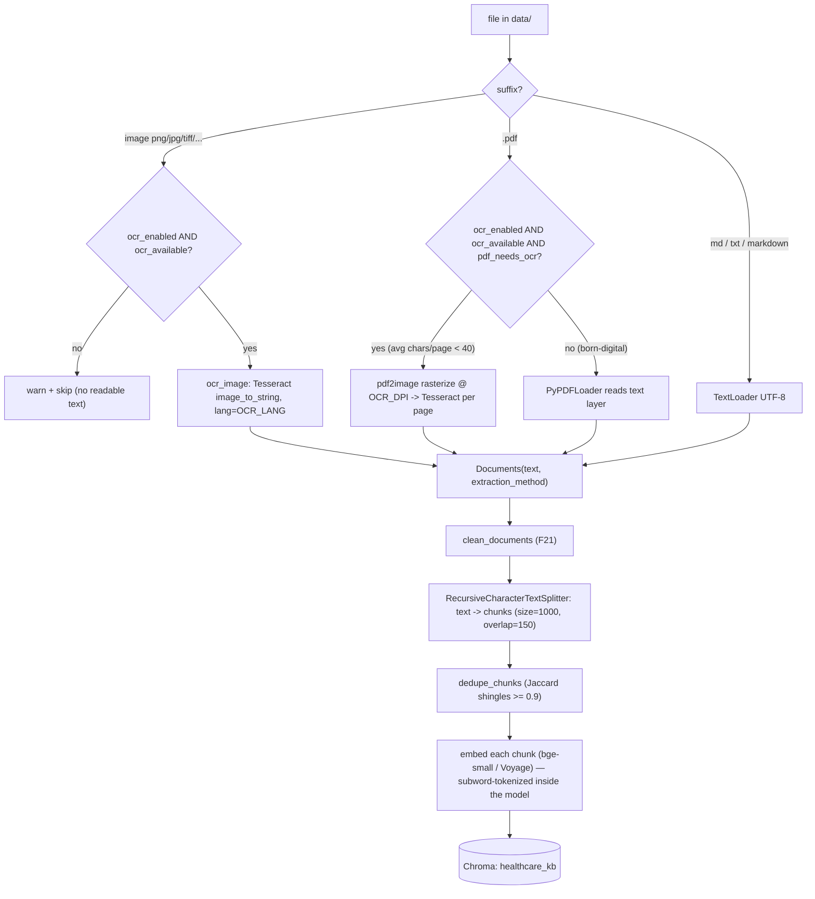

# Ingestion — getting documents searchable

> **Ingestion** is the offline half of RAG: it turns files on disk into embedded,
> searchable chunks in Chroma. Nothing can be *retrieved* that wasn't first *ingested*.
> This doc covers every step and every way to add documents. For the whole-pipeline
> mental model see [`HOW-RAG-WORKS.md`](HOW-RAG-WORKS.md).

The pipeline, in one line (`app/ingest.py`):

```
load (pdf/md/txt/image) → clean (F21) → split → dedupe → embed → Chroma
```

---

## Supported formats

`load_one()` routes each file by suffix. The full supported set is text formats **plus**
OCR-able images:

| Suffix | Path | Extractor | `extraction_method` |
|---|---|---|---|
| `.md`, `.markdown`, `.txt` | text | `TextLoader` (UTF-8) | `text` |
| `.pdf` (born-digital) | text layer | `PyPDFLoader` | `text` |
| `.pdf` (scanned / image-only) | OCR | `pdf2image` → Tesseract | `ocr` |
| `.png .jpg .jpeg .tif .tiff .bmp .webp` | OCR | Tesseract (`image_to_string`) | `ocr` |

Every extracted page becomes a `langchain_core.documents.Document` stamped with
`source` (filename), `page`, and `extraction_method`. That metadata rides all the way
through to citations and the F23 trace, so an answer can tell you a passage came from
`hypertension.txt, p.12` via `ocr`.

---

## The OCR path (F20)

OCR is **fully local** — Tesseract via `pytesseract`, no cloud, no API keys
(`app/ocr.py`). Two things make it cheap and robust:

**1. OCR only when needed.** `pdf_needs_ocr()` reads a PDF's existing text layer with
`pypdf` and computes average characters per page. If that average is **below
`OCR_MIN_CHARS_PER_PAGE` (default 40)** the PDF is scanned → OCR; otherwise the fast
born-digital text layer is used. On any read error, it assumes scanned (safe default).
So born-digital PDFs never pay the OCR cost.

**2. Lazy imports + graceful degradation.** `pytesseract`, `pdf2image`, and `PIL` are
imported *inside* the functions that need them, and `ocr_available()` probes for both the
`tesseract` binary (on PATH) and the Python bindings. If the stack is missing, image
files are **skipped with a warning** rather than crashing ingestion — and the offline
test-suite still imports cleanly. OCR is gated by `OCR_ENABLED` (default `true`).



> **"tokenization" during ingest.** Chunking is *character*-based (the splitter counts
> characters, not tokens). The only tokenization at ingest time is the embedding model's
> **subword tokenizer**, which runs inside `embed` to turn each chunk's text into a
> vector. The separate **lexical** tokenizer (`_tokenize`, keeps `2.5mg`/`12.4` whole) is a
> query-time / BM25 concern — see [`HOW-RAG-WORKS.md`](HOW-RAG-WORKS.md#7-query--tokenization--retrieval).

### OCR-relevant settings

| Env var | Default | Meaning |
|---|---|---|
| `OCR_ENABLED` | `true` | OCR images + scanned PDFs during ingest |
| `OCR_LANG` | `eng` | Tesseract language pack(s), e.g. `eng+deu` |
| `OCR_DPI` | `200` | rasterization DPI for scanned-PDF pages (higher = sharper but slower) |
| `OCR_MIN_CHARS_PER_PAGE` | `40` | below this average → PDF treated as scanned |

---

## The cleaning steps (F21)

`clean_documents()` (`app/cleaning.py`) sits between *load* and *split*. It is
deterministic (no model calls) so it's fast, unit-tested, and traceable. Per page:

| Step | What it does | Example |
|---|---|---|
| `normalize_unicode` (NFKC) | canonicalize look-alike glyphs | full-width → ASCII |
| `strip_control_chars` | remove non-printable bytes | drops `\x00`–`\x1f` |
| `join_hyphenated_linebreaks` | re-join words split at line end | `inter-\nnational` → `international` |
| `drop_page_number_lines` | delete lines that are only a page number | `12`, `Page 3 / 20` |
| `collapse_whitespace` | squeeze runs of spaces/newlines | `"a    b"` → `"a b"` |

Plus a **document-level** pass: pages are grouped by `source`, and any short line
(≤ 120 chars) recurring on ≥ `header_footer_min_page_fraction` (0.6) of pages — with at
least `header_footer_min_pages` (3) pages — is stripped as a running header/footer.
Empty pages after cleaning are dropped. Toggle with `CLEAN_ENABLED` (default `true`).

`clean_text()` can return a `CleanReport` (chars before/after + which steps ran) — the
raw→clean transparency the F23 layer can render.

---

## Chunking + dedupe params

`split_documents()` uses `RecursiveCharacterTextSplitter`:

| Env var | Default | Meaning |
|---|---|---|
| `CHUNK_SIZE` | `1000` | target max chars per chunk |
| `CHUNK_OVERLAP` | `150` | chars repeated between adjacent chunks (so boundary facts survive) |
| `DEDUPE_ENABLED` | `true` | drop near-duplicate chunks after splitting |
| `DEDUPE_THRESHOLD` | `0.9` | Jaccard over 5-word shingles ≥ this ⇒ duplicate |

`add_start_index=True` records each chunk's character offset in its source. Dedupe keeps
the *first* occurrence of near-identical chunks, killing repeated boilerplate.

---

## How to add documents

There are three ways, all landing in the same Chroma collection.

### 1. Bulk: drop files in `data/` then run the module

```bash
# put your .pdf / .md / .txt / images anywhere under data/ (recursively scanned)
python -m app.ingest
```

`build_index()` is **idempotent**: it *resets* the collection first, so the index always
mirrors the current `data/` folder exactly. Output: `Ingested N documents into M chunks`.
Use this for the initial build or a full rebuild.

### 2. API rebuild: `POST /v1/ingest`

Rebuilds the whole index from `data/` and hot-reloads the engine against the fresh index.
Same effect as the module, triggered over HTTP (auth + rate-limit guarded).

### 3. Incremental upload: `POST /v1/upload` (F18)

Add **one** document to the *live* index without a full rebuild (`add_file_to_store`):

```bash
curl -X POST "localhost:8000/v1/upload?filename=metformin_label.pdf" \
  --data-binary @metformin_label.pdf
```

- Body is the **raw file bytes**; `filename` (query param) carries the name (no multipart
  dependency). The basename is taken to strip path traversal.
- **Idempotent per filename**: existing chunks for the same `source` are deleted first,
  so re-uploading *replaces* rather than duplicates.
- Guards: unsupported suffix → `415`; empty body → `400`; over `MAX_UPLOAD_MB` (25) →
  `413`; no readable text (e.g. an image OCR'd to nothing) → `400`.
- After adding, it **rebuilds the retriever** so the BM25 (lexical) arm sees the new
  chunks immediately (the dense arm reads Chroma live, but BM25 is built from a snapshot).
- Files are saved under `data/uploads/`.

| Method | Scope | Resets collection? | Use when |
|---|---|---|---|
| `python -m app.ingest` | whole `data/` | yes | initial build / full rebuild |
| `POST /v1/ingest` | whole `data/` | yes | rebuild over HTTP |
| `POST /v1/upload` | one file | no (per-source replace) | add/replace a single doc live |

Check what's indexed with `GET /v1/sources` (chunk counts per source).

---

## Getting a real corpus: `scripts/fetch_corpus.py` (F22)

The bundled `data/` is synthetic. To ingest **real** documents, fetch open-access
biomedical literature from **Europe PMC** — articles marked `OPEN_ACCESS` are licensed
for reuse (paywalled content is deliberately excluded). The script pulls the top
open-access article for each configured clinical topic:

```bash
python scripts/fetch_corpus.py                 # fetch defaults into data/corpus/
python scripts/fetch_corpus.py --limit 3       # first 3 topics only
python scripts/fetch_corpus.py --dry-run       # list articles, download nothing
python -m app.ingest                           # then (re)build the index
```

Design notes: **stdlib only** (`urllib`, no new dependency); **idempotent** (skips files
already present); **polite** (sends a descriptive User-Agent, rate-limited); **open access
only** (every query is constrained with `AND OPEN_ACCESS:Y`); **offline-safe** (network
errors are logged and skipped, never fatal); **provenance** (every download is recorded in
`data/SOURCES.md` with its URL). Default topics: hypertension, diabetes, asthma,
anticoagulation, sepsis. Set a contact for the User-Agent:

```bash
CORPUS_USER_AGENT="my-project (github.com/you)" python scripts/fetch_corpus.py
```

The fetcher requests each article's full-text XML (falling back to its abstract), strips
markup to text itself (tags, script/style, entity-unescape, whitespace) and writes
`data/corpus/<slug>.txt`, which then flows through the normal ingest pipeline as a text file.

---

## Running on Windows (Poppler + Tesseract PATH)

> This project is **authored on Linux** but **run on a Windows machine with an RTX GPU**
> (Ollama uses the GPU for `llama3.1:8b`). The Python bindings come from
> `requirements.txt`, but OCR needs two **native** engines that pip can't provide.

On Linux, `scripts/install-ocr.sh` handles it (`dnf`/`apt`/`brew` → `tesseract` +
`poppler-utils`). On Windows, install both engines and put them on `PATH`:

| Engine | Why | Get it | PATH entry |
|---|---|---|---|
| **Tesseract** | the OCR engine `pytesseract` calls | UB-Mannheim installer: `github.com/UB-Mannheim/tesseract/wiki` | the install dir, e.g. `C:\Program Files\Tesseract-OCR` |
| **Poppler** | `pdf2image` shells out to Poppler to rasterize PDF pages | `github.com/oschwartz10612/poppler-windows/releases` | the extracted `...\poppler-xx\Library\bin` |

Steps:

1. Install Tesseract (tick the language packs you need; `eng` is default). Add its folder
   to the **PATH** environment variable.
2. Extract Poppler, add its `bin/` to **PATH** (or pass `poppler_path=` to
   `convert_from_path` if you'd rather not touch PATH).
3. `pip install -r requirements.txt` (brings `pytesseract pdf2image pillow`).
4. **Open a new terminal** (so PATH changes take effect), then verify:

   ```powershell
   tesseract --version
   pdftoppm -h      # from Poppler; confirms Poppler is on PATH
   ```

5. `python -c "from app import ocr; print(ocr.ocr_available())"` should print `True`.
6. `python -m app.ingest` — images and scanned PDFs in `data/` now get OCR'd.

If `ocr_available()` is `False`, ingestion still works for text files and born-digital
PDFs; it just **skips images with a warning** instead of failing.
